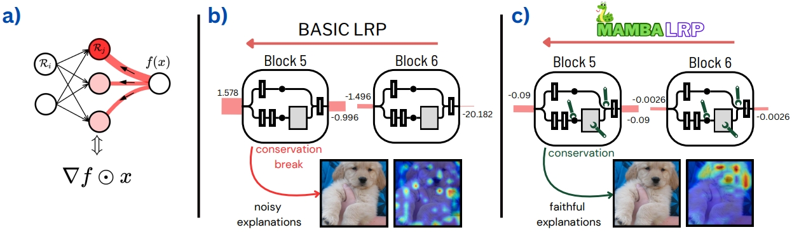

<center>
    
</center>

This is the official implementation of our NeurIPS 2024 paper, [MambaLRP: Explaining Selective State Space Sequence Models](https://arxiv.org/abs/2406.07592).

```BibTeX
@inproceedings{jafari2024mambalrp,
    title={MambaLRP: Explaining Selective State Space Sequence Models},
    author={Farnoush Rezaei Jafari and Grégoire Montavon and Klaus-Robert Müller and Oliver Eberle},
    booktitle={The Thirty-eighth Annual Conference on Neural Information Processing Systems},
    year={2024}
}
```

<div align="center">
    
[](https://colab.research.google.com/github/FarnoushRJ/MambaLRP/blob/main/minimal_demo.ipynb)
[]([https://github.com/FarnoushRJ/MambaLRP/blob/master/LICENSE](https://github.com/FarnoushRJ/MambaLRP/blob/main/LICENSE))

</div>

If you find this code useful, please star the repository.

<p align="left">
  
</p>

<p align="justify">Recent sequence modeling approaches using selective state space sequence models, referred to as Mamba models, have seen a surge of interest. These models allow efficient processing of long sequences in linear time and are rapidly being adopted in a wide range of applications such as language modeling, demonstrating promising performance. To foster their reliable use in real-world scenarios, it is crucial to augment their transparency. Our work bridges this critical gap by bringing explainability, particularly Layer-wise Relevance Propagation (LRP), to the Mamba architecture. Guided by the axiom of relevance conservation, we identify specific components in the Mamba architecture, which cause unfaithful explanations. To remedy this issue, we propose MambaLRP, a novel algorithm within the LRP framework, which ensures a more stable and reliable relevance propagation through these components. Our proposed method is theoretically sound and excels in achieving state-of-the-art explanation performance across a diverse range of models and datasets. Moreover, MambaLRP facilitates a deeper inspection of Mamba architectures, uncovering various biases and evaluating their significance. It also enables the analysis of previous speculations regarding the long-range capabilities of Mamba models.</p>

<p align="center">
  
  <figcaption>Conceptual steps involved in the design of MambaLRP. (a) Take as a starting point a basic LRP procedure, equivalent to Gradient x Input. (b) Analyze layers in which the conservation property is violated. (c) Rework the relevance propagation strategy at those layers to achieve conservation. The resulting MambaLRP method enables efficient and faithful explanations.</figcaption>
</p> 

<p align="left">
  
</p>

```python
!git clone https://github.com/FarnoushRJ/MambaLRP.git
!pip install git+file:///content/MambaLRP --quiet
```

<p align="left">
  
</p>

- [x] Add LRP for Mamba.
- [x] Add a demo notebook.
- [x] Add LRP for Vision Mamba.
- [ ] Add evaluation codes.

<p align="left">
  
</p>

- This repo is built using components from [Hugging Face](https://huggingface.co/docs/transformers/en/model_doc/mamba), [Mamba](https://github.com/state-spaces/mamba), and [Vision Mamba](https://github.com/hustvl/Vim).
- The logos are created using [Canva](https://www.canva.com/).
