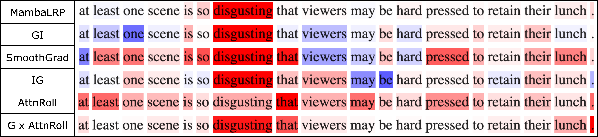
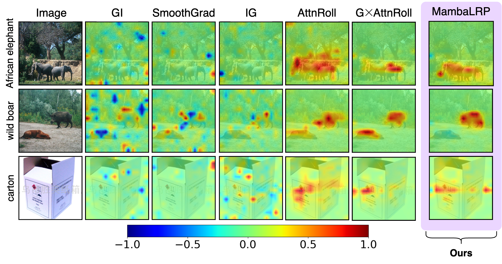
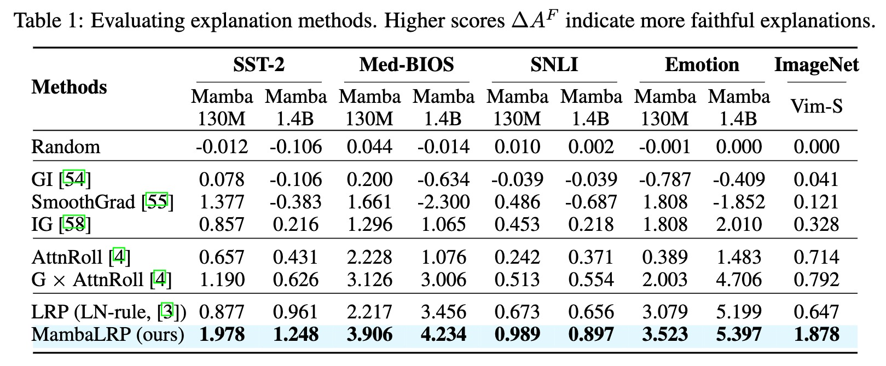

<center>
    
</center>

<<<<<<< Updated upstream
This is the official implementation of the paper "[MambaLRP: Explaining Selective State Space Sequence Models]()".
=======
This is the official implementation of the paper "[MambaLRP: Explaining Selective State Space Sequence Models](https://arxiv.org/pdf/2406.07592)".

```BibTeX
@misc{jafari2024mambalrp,
      title={MambaLRP: Explaining Selective State Space Sequence Models}, 
      author={Farnoush Rezaei Jafari and Grégoire Montavon and Klaus-Robert Müller and Oliver Eberle},
      year={2024},
      eprint={2406.07592},
      archivePrefix={arXiv},
      primaryClass={cs.LG}
}
```

## Abstract
<p align="justify">Recent sequence modeling approaches using Selective State Space Sequence Models, referred to as Mamba models, have seen a surge of interest. These models allow efficient processing of long sequences in linear time and are rapidly being adopted in a wide range of applications such as language modeling, demonstrating promising performance. To foster their reliable use in real-world scenarios, it is crucial to augment their transparency. Our work bridges this critical gap by bringing explainability, particularly Layer-wise Relevance Propagation (LRP), to the Mamba architecture. Guided by the axiom of relevance conservation, we identify specific components in the Mamba architecture, which cause unfaithful explanations. To remedy this issue, we propose MambaLRP, a novel algorithm within the LRP framework, which ensures a more stable and reliable relevance propagation through these components. Our proposed method is theoretically sound and excels in achieving state-of-the-art explanation performance across a diverse range of models and datasets. Moreover, MambaLRP facilitates a deeper inspection of Mamba architectures, uncovering various biases and evaluating their significance. It also enables the analysis of previous speculations regarding the long-range capabilities of Mamba models.</p>

## Qualitative Results

### NLP 
<center>
    
</center>

### Vision 
<center>
    
</center>

## Quantitative Results
<center>
    
</center>
>>>>>>> Stashed changes

## Requirements
Please make sure your setup satisfies the following requirements:
- Python==3.10.6
- Numpy
- PyTorch==2.1.1+cu118
- transformers==4.40.1
- pip install causal-conv1d>=1.2.0
- pip install mamba-ssm

## Acknowledgements
<<<<<<< Updated upstream
This repo is built using components from [Hugging Face](https://huggingface.co/docs/transformers/en/model_doc/mamba) and [Mamba](https://github.com/state-spaces/mamba)
=======
This repo is built using components from [Hugging Face](https://huggingface.co/docs/transformers/en/model_doc/mamba) and [Mamba](https://github.com/state-spaces/mamba).
>>>>>>> Stashed changes
